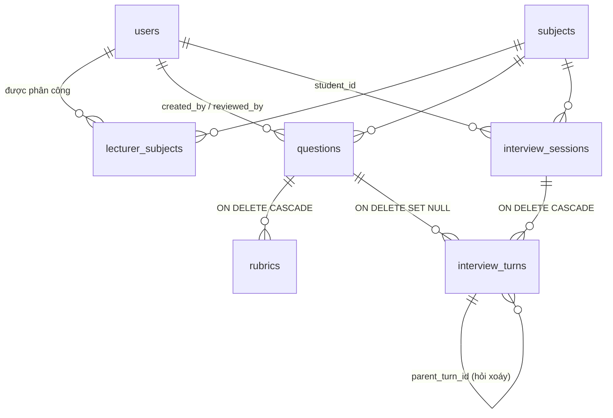

# AIVES – Thiết kế CRUD cho Feature 1, 3, 7

Stack: **Java 8 · Servlet 4 / JSP + JSTL · PostgreSQL · Tomcat 9** (MVC: Servlet → DAO → JSP)

## 1. Cơ sở dữ liệu (PostgreSQL)

Script: [`database/aives_schema.sql`](../database/aives_schema.sql) — khoá chính `INT GENERATED ALWAYS AS IDENTITY`,
cờ dùng `BOOLEAN`, văn bản dài dùng `TEXT`, thời gian `TIMESTAMP`. Tìm kiếm dùng `ILIKE` (không phân biệt hoa thường),
bốc câu hỏi ngẫu nhiên bằng `ORDER BY RANDOM() LIMIT ?`.

| Bảng | Feature | Ghi chú |
|---|---|---|
| `users` | 7 | `role` ∈ ADMIN / LECTURER / STUDENT; mật khẩu PBKDF2 (`iterations:salt:hash`) |
| `subjects` | 7 | `active = FALSE` để ngừng dùng thay vì xoá |
| `lecturer_subjects` | 7 | Phân quyền giảng viên ↔ môn học |
| `system_configs` | 7 | key/value: `speech.language`, `interview.answer_time`, `interview.max_followups`, `interview.main_questions` |
| `questions` | 1 | `bloom_level` (6 mức), `status` DRAFT → PENDING_REVIEW → APPROVED / REJECTED, `source` MANUAL / IMPORT / AI |
| `rubrics` | 1 | Tiêu chí + `max_score` + `keywords` (AI dùng để phát hiện thiếu ý) |
| `interview_sessions` | 3 | Snapshot giới hạn thời gian / số câu xoáy tại thời điểm thi |
| `interview_turns` | 3 | Một lượt hỏi-đáp. Thứ tự hỏi: `ORDER BY main_index, followup_index`. Lưu snapshot `question_text` |

## 2. Phân quyền (AuthFilter)

| URL | Vai trò |
|---|---|
| `/login`, `/logout`, `/assets/*` | Công khai |
| `/admin/*` | ADMIN |
| `/lecturer/*` | LECTURER, ADMIN (giảng viên chỉ thao tác trên **môn được phân công**) |
| `/student/*` | STUDENT (chỉ thấy lượt thi **của mình**) |

**Không trả lỗi 403.** Khi bị từ chối, người dùng được đưa về trang đăng nhập kèm lời nhắc lịch sự
(`WebUtil.redirectToLogin` / `WebUtil.denyAccess`):

| Tình huống | Lời nhắc trên trang đăng nhập |
|---|---|
| Chưa đăng nhập / hết phiên | "Vui lòng đăng nhập để tiếp tục sử dụng hệ thống." |
| Đã đăng nhập nhưng không đủ quyền (sai vai trò, hoặc GV truy cập môn không được phân công) | "Rất tiếc, tài khoản của bạn hiện chưa được cấp quyền truy cập trang này. Bạn vui lòng đăng nhập bằng tài khoản phù hợp hoặc liên hệ quản trị viên nếu cần hỗ trợ." |
| Đăng xuất | "Bạn đã đăng xuất thành công. Hẹn gặp lại!" |

Trang bị chặn (request GET) được ghi nhớ; đăng nhập bằng tài khoản phù hợp sẽ quay lại đúng trang đó.
Nếu vẫn đang đăng nhập, trang đăng nhập hiện thêm link "Quay lại trang của tôi".

## 3. Bảng CRUD

### Feature 7 – Quản trị hệ thống

| Đối tượng | Create | Read | Update | Delete |
|---|---|---|---|---|
| Tài khoản `/admin/users` | `?action=create` → POST `action=save` | List + lọc theo vai trò, từ khoá | `?action=edit&id=` (để trống mật khẩu = giữ nguyên); gán môn cho GV | POST `action=delete` – bị chặn nếu đã có dữ liệu → khoá tài khoản thay thế |
| Môn học `/admin/subjects` | `?action=create` | List | `?action=edit&id=` | POST `action=delete` – bị chặn nếu đã có câu hỏi/lượt thi |
| Cấu hình `/admin/configs` | – (seed sẵn) | Form | POST (validate: ngôn ngữ vi-VN/en-US, 15–900s, 0–5 câu xoáy, 1–20 câu chính) | – |
| Đăng nhập / đăng xuất | POST `/login` | – | – | POST `/logout` (invalidate session) |

### Feature 1 – Ngân hàng câu hỏi & rubric

| Đối tượng | Create | Read | Update | Delete |
|---|---|---|---|---|
| Câu hỏi `/lecturer/questions` | Nhập tay (`DRAFT`) hoặc **AI sinh** `?action=generate` (`PENDING_REVIEW`) | List + lọc môn / trạng thái / Bloom / từ khoá | Sửa nội dung; đổi trạng thái POST `action=status&to=APPROVED\|REJECTED\|DRAFT` | POST `action=delete` (rubric xoá theo) |
| Rubric `/lecturer/rubrics` | POST `id=0` | Hiển thị trong trang sửa câu hỏi + tổng điểm | POST `id=<id>` | POST `action=delete` |

Quy tắc: **chỉ câu `APPROVED` mới vào ngân hàng chính thức**, và phải có ≥ 1 tiêu chí rubric mới được duyệt.

### Feature 3 – Phỏng vấn AI

| Đối tượng | Create | Read | Update | Delete |
|---|---|---|---|---|
| Lượt thi (SV) `/student/interview` | POST `action=start` – chọn ngẫu nhiên N câu APPROVED; nếu đang có lượt dở thì tiếp tục | Danh sách lịch sử; `?id=` xem câu hiện tại hoặc transcript | POST `action=answer` (lưu transcript, tính thời gian phía server); `action=abort` | – |
| Lượt thi (GV) `/lecturer/sessions` | – | List + transcript đầy đủ `?action=view&id=` | – | POST `action=delete` |

Luồng mỗi câu trả lời (`InterviewService.submitAnswer`):

1. Lưu transcript cho lượt hiện tại (bỏ qua nếu gửi trùng / không phải lượt hiện tại).
2. Nếu số câu xoáy của câu chính này < `max_followups` → gọi `FollowUpGenerator`:
   - trả lời quá ngắn (< 8 từ) → yêu cầu giải thích thêm;
   - có tiêu chí rubric mà chưa từ khoá nào xuất hiện → hỏi xoáy đúng tiêu chí đó.
3. Hết câu chưa trả lời → `COMPLETED`.

Phía trình duyệt: TTS = `speechSynthesis`, STT = `SpeechRecognition` (Chrome/Edge), đếm ngược hết giờ tự nộp.

## 4. Điểm mở rộng cho AI thật

| Interface | Bản demo | Thay bằng |
|---|---|---|
| `QuestionGenerator` | `TemplateQuestionGenerator` (mẫu câu theo Bloom) | LLM + RAG trên giáo trình / slide |
| `FollowUpGenerator` | `RuleBasedFollowUpGenerator` (độ dài + từ khoá rubric) | LLM nhận câu hỏi, rubric, transcript |

Chỉ cần viết class mới implement interface và truyền vào `InterviewService` / `QuestionServlet`, không phải sửa DAO hay JSP.

## 5. Chạy thử

1. Tạo DB, chạy schema và (tuỳ chọn) dữ liệu demo — hoặc mở file trong pgAdmin → Query Tool:
   `createdb -U postgres aives`
   `psql -U postgres -d aives -f database/aives_schema.sql`
   `psql -U postgres -d aives -f database/aives_demo_data.sql`
2. Sửa `src/main/resources/db.properties` (URL / user / password PostgreSQL), hoặc truyền JVM option `-Ddb.password=...`.
3. Build `mvn package` → deploy `target/aives_system.war` lên **Tomcat 9** (dùng `javax.servlet`, không chạy được trên Tomcat 10+).

Tài khoản demo (từ `aives_demo_data.sql`; nếu bỏ qua file này, app tự tạo `admin`, `lecturer1`, `student1` khi khởi động):

| Username | Mật khẩu | Vai trò |
|---|---|---|
| `admin` | `admin123` | Quản trị viên |
| `lecturer1` | `123456` | Giảng viên – PRJ301, SWP391 |
| `lecturer2` | `123456` | Giảng viên – DBI202 |
| `student1` … `student3` | `123456` | Sinh viên |

Kịch bản demo: `lecturer1` duyệt các câu AI sinh đang chờ (thêm rubric có từ khoá) → `student1` thi môn PRJ301,
trả lời ngắn để thấy AI hỏi xoáy → `lecturer1` xem transcript ở **Lượt phỏng vấn**.

Thiết kế chi tiết: [DATABASE_DESIGN.md](DATABASE_DESIGN.md) (ERD, từ điển dữ liệu) · [UI_UX_DESIGN.md](UI_UX_DESIGN.md) (design system, bản đồ màn hình).

## 6. Chưa làm (để sau)

- Import câu hỏi từ file Excel/CSV (`source = IMPORT` đã có sẵn trong schema).
- Token CSRF cho các form POST.
- Ghi âm / ghi hình (Feature 5), chấm điểm AI (Feature 4), kỳ thi & lịch thi (Feature 2) – hiện SV tự chọn môn để thi demo.
