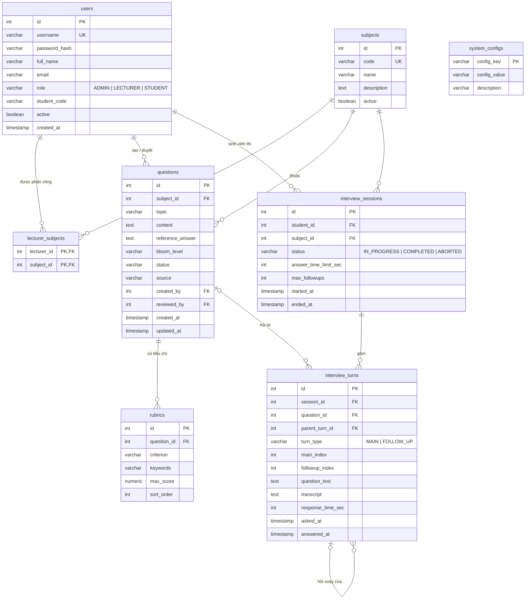

# AIVES – Thiết kế cơ sở dữ liệu (PostgreSQL)

Khớp 1–1 với code hiện tại (`com.aives.model` + `com.aives.dao`).

- Schema: [`database/aives_schema.sql`](../database/aives_schema.sql)
- Dữ liệu demo: [`database/aives_demo_data.sql`](../database/aives_demo_data.sql)

```bash
createdb -U postgres aives
psql -U postgres -d aives -f database/aives_schema.sql
psql -U postgres -d aives -f database/aives_demo_data.sql   # tuỳ chọn
```

## 1. Sơ đồ ERD



## 2. Từ điển dữ liệu

### Feature 7 – Quản trị hệ thống

**`users`** – tài khoản cho cả 3 vai trò (Java: `User`, `Role`)

| Cột | Kiểu | Ràng buộc | Ghi chú |
|---|---|---|---|
| id | INT | PK, IDENTITY | |
| username | VARCHAR(50) | NOT NULL, UNIQUE | 3–50 ký tự `[A-Za-z0-9._]` (kiểm tra ở servlet) |
| password_hash | VARCHAR(255) | NOT NULL | PBKDF2-SHA256, dạng `iterations:salt:hash` (Base64) |
| full_name | VARCHAR(100) | NOT NULL | |
| email | VARCHAR(100) | | |
| role | VARCHAR(20) | NOT NULL, CHECK | `ADMIN` / `LECTURER` / `STUDENT` |
| student_code | VARCHAR(20) | | MSSV, bắt buộc với STUDENT (kiểm tra ở servlet) |
| active | BOOLEAN | NOT NULL, DEFAULT TRUE | `FALSE` = tạm khoá, không đăng nhập được |
| created_at | TIMESTAMP | NOT NULL, DEFAULT now | |

**`subjects`** – môn học (`Subject`): `code` UNIQUE; `active = FALSE` để ngừng dùng thay vì xoá.

**`lecturer_subjects`** – phân quyền giảng viên ↔ môn (N–N). PK kép, xoá user/môn thì xoá theo (CASCADE).

**`system_configs`** – cấu hình key/value (`SystemConfig`):

| config_key | Mặc định | Ý nghĩa |
|---|---|---|
| `speech.language` | `vi-VN` | Ngôn ngữ STT/TTS (`vi-VN` / `en-US`) |
| `interview.answer_time` | `120` | Giây trả lời mỗi câu (15–900) |
| `interview.max_followups` | `2` | Câu hỏi xoáy tối đa / câu chính (0–5) |
| `interview.main_questions` | `3` | Số câu chính / lượt thi (1–20) |

### Feature 1 – Ngân hàng câu hỏi & rubric

**`questions`** (`Question`, `BloomLevel`, `QuestionStatus`, `QuestionSource`)

| Cột | Kiểu | Ràng buộc | Ghi chú |
|---|---|---|---|
| subject_id | INT | FK → subjects, NOT NULL | Không cho xoá môn khi còn câu hỏi |
| topic | VARCHAR(200) | | Chương / chủ đề |
| content | TEXT | NOT NULL | Nội dung AI đọc khi phỏng vấn |
| reference_answer | TEXT | | Chỉ giảng viên xem |
| bloom_level | VARCHAR(20) | CHECK | `REMEMBER, UNDERSTAND, APPLY, ANALYZE, EVALUATE, CREATE` |
| status | VARCHAR(20) | CHECK, DEFAULT `DRAFT` | `DRAFT → PENDING_REVIEW → APPROVED / REJECTED` |
| source | VARCHAR(10) | CHECK, DEFAULT `MANUAL` | `MANUAL / IMPORT / AI` |
| created_by / reviewed_by | INT | FK → users | Người tạo / người duyệt |
| created_at / updated_at | TIMESTAMP | | `updated_at` cập nhật khi sửa / đổi trạng thái |

Chỉ mục: `ix_questions_subject_status (subject_id, status)` – phục vụ lọc ngân hàng câu hỏi và bốc câu đã duyệt.

**`rubrics`** (`Rubric`) – tiêu chí chấm của câu hỏi; `max_score NUMERIC(5,2) > 0`; `keywords` (phân tách dấu phẩy) cho AI phát hiện thiếu ý. Xoá câu hỏi thì xoá rubric (CASCADE).

### Feature 3 – Phỏng vấn AI

**`interview_sessions`** (`InterviewSession`) – một lượt thi. `answer_time_limit_sec`, `max_followups` là **snapshot** cấu hình lúc bắt đầu, để đổi cấu hình không ảnh hưởng lượt đang thi.

**`interview_turns`** (`InterviewTurn`) – một lượt hỏi–đáp.

| Cột | Ghi chú |
|---|---|
| question_id | FK → questions, **ON DELETE SET NULL** (xoá câu hỏi vẫn giữ lịch sử thi) |
| parent_turn_id | FK tự tham chiếu: câu hỏi xoáy trỏ về câu chính |
| turn_type | `MAIN` / `FOLLOW_UP` |
| main_index, followup_index | Thứ tự hỏi = `ORDER BY main_index, followup_index` (câu chính có `followup_index = 0`) |
| question_text | **Snapshot** nội dung câu hỏi tại thời điểm hỏi |
| transcript | Văn bản STT câu trả lời |
| asked_at / answered_at | `response_time_sec` tính phía server = `answered_at - asked_at` |

Chỉ mục: `ix_turns_session (session_id, main_index, followup_index)` – lấy lượt hỏi hiện tại (`answered_at IS NULL ... LIMIT 1`).

## 3. Quy tắc toàn vẹn

| Tình huống | Xử lý |
|---|---|
| Xoá user đã tạo câu hỏi / đã thi | FK chặn → giao diện gợi ý **tạm khoá** thay vì xoá |
| Xoá môn đã có câu hỏi / lượt thi | FK chặn → gợi ý **ngừng mở** môn |
| Xoá câu hỏi | Rubric xoá theo; turn cũ giữ `question_text`, `question_id = NULL` |
| Xoá lượt thi | Toàn bộ turn xoá theo (CASCADE) |
| Duyệt câu hỏi | Bắt buộc ≥ 1 rubric (kiểm tra ở `QuestionServlet`) |

## 4. Đặc thù PostgreSQL trong code

| Nhu cầu | Câu lệnh |
|---|---|
| Khoá tự tăng | `INT GENERATED ALWAYS AS IDENTITY`, lấy id bằng `prepareStatement(sql, new String[] {"id"})` |
| Bốc ngẫu nhiên N câu đã duyệt | `ORDER BY RANDOM() LIMIT ?` |
| Tìm kiếm không phân biệt hoa thường | `ILIKE` |
| Thời gian hiện tại | `LOCALTIMESTAMP` |
| Tính thời gian trả lời | `CAST(EXTRACT(EPOCH FROM LOCALTIMESTAMP - asked_at) AS INT)` |
| Cờ bật/tắt | `BOOLEAN` (`active = TRUE`) |
